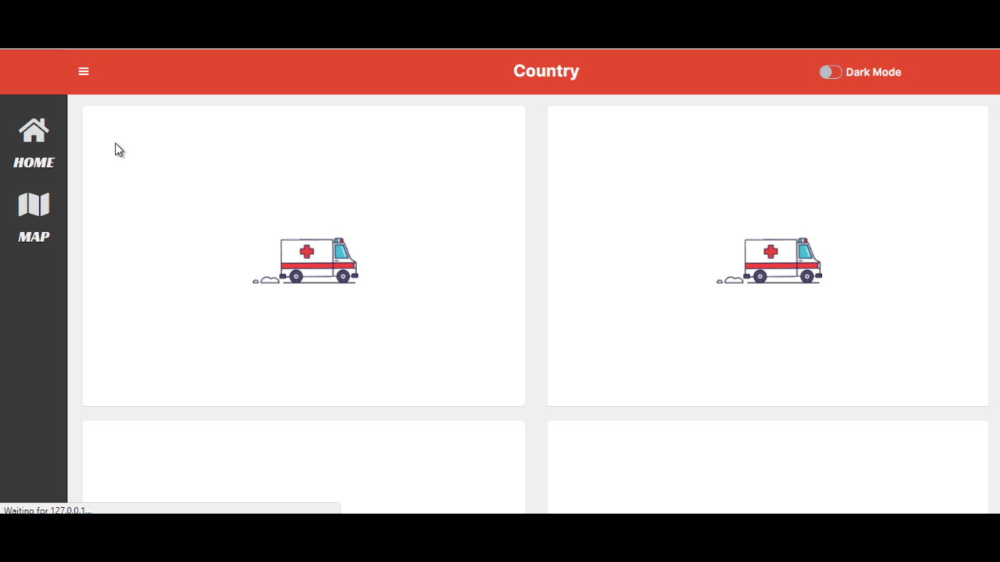

<!-- README.md is generated from README.Rmd. Please edit that file -->

# shinyDarkmode

<!-- badges: start -->

<!-- badges: end -->

In this package we use [darkmodejs](https://darkmodejs.learn.uno/) which
enables a darkmode to your shiny app in a few seconds.

## Installation

You can install the released version of shinyDarkmode from Github with:

``` r
# install.packages("remotes")
remotes::install_github("deepanshu88/shinyDarkmode")
```

## Example

This is a basic example which shows you how to add darkmode. To know how
to add darkmode with custom checkbox, check out the complete
documentation of [shinyDarkmode](https://www.listendata.com/2021/03/shinydarkmode-add-darkmode-to-shiny-apps.html)

``` r
library(shiny)
library(shinyDarkmode)
 
 vars <- setdiff(names(iris), "Species")
 ui <- fluidPage(

   titlePanel("Sample App"),

   # Setup
   use_darkmode(),

   sidebarPanel(
     selectInput('xcol', 'X Variable', vars),
     selectInput('ycol', 'Y Variable', vars, selected = vars[[2]]),
     numericInput('clusters', 'Cluster count', 3, min = 1, max = 9)
   ),
   mainPanel(
     plotOutput('plot1')
   ),

   column(width = 12,
          DT::dataTableOutput("mydt")
   )
 )

 # Server
 server <- function(input, output, session) {

   darkmode(label = "⏳")

   # Combine the selected variables into a new data frame
   selectedData <- reactive({
     iris[, c(input$xcol, input$ycol)]
   })

   clusters <- reactive({
     kmeans(selectedData(), input$clusters)
   })

   output$plot1 <- renderPlot({
     palette(c("#E41A1C", "#377EB8", "#4DAF4A", "#984EA3",
               "#FF7F00", "#FFFF33", "#A65628", "#F781BF", "#999999"))

     par(mar = c(5.1, 4.1, 0, 1))
     plot(selectedData(),
          col = clusters()$cluster,
          pch = 20, cex = 3)
     points(clusters()$centers, pch = 4, cex = 4, lwd = 4)
   })

   output$mydt <- DT::renderDataTable(iris,
                                      options = list(pageLength = 10, autoWidth = TRUE),
                                      rownames= FALSE)

 }

 # Run App
 shinyApp(ui = ui, server = server)
```

